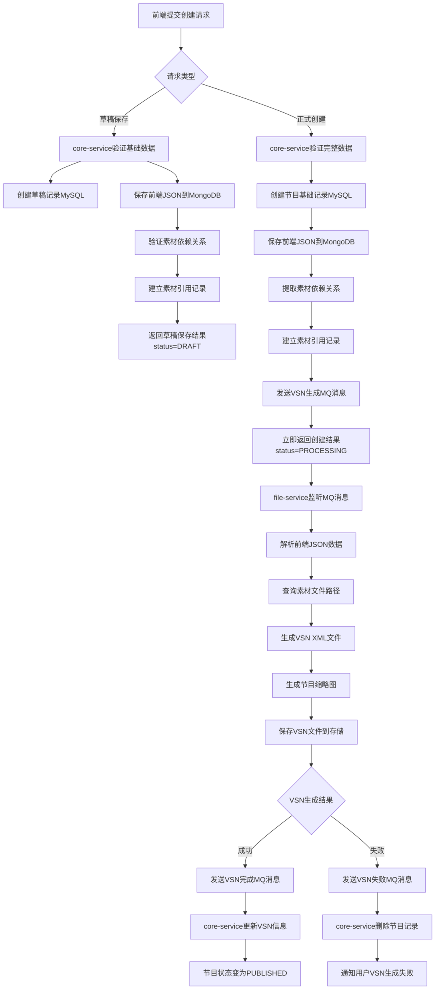
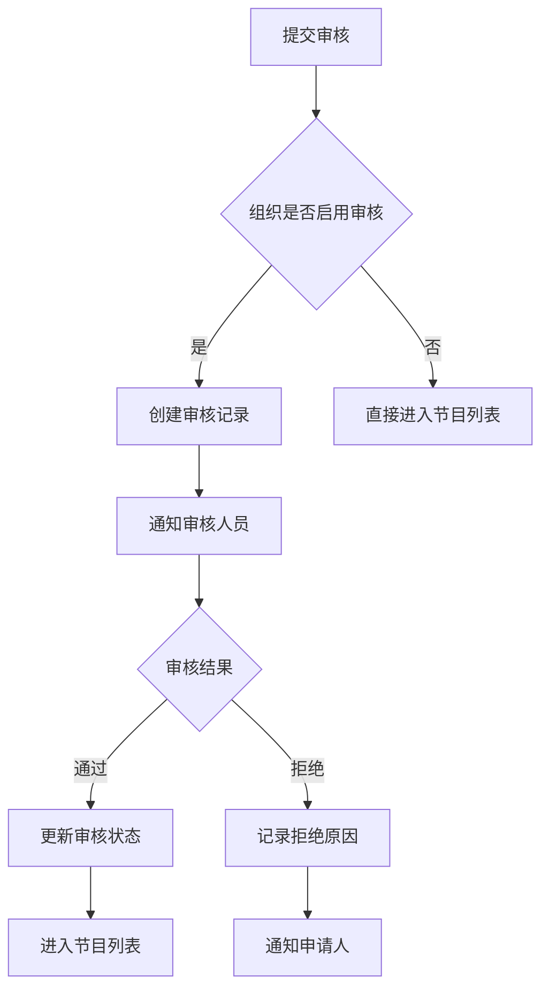
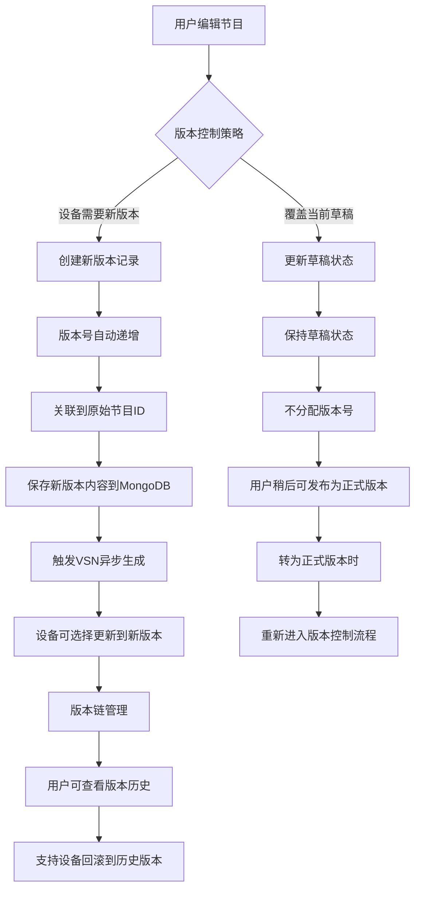

# 节目管理模块设计文档

## 1. 模块概述

### 1.1 背景
LED设备节目管理系统是云平台的核心功能模块，专注于节目内容的创建、编辑、版本管理和VSN格式转换。本模块以**LED硬件设备管理**为核心场景，通过版本控制机制支持节目的历史追溯，为用户提供优秀的版本管理体验。

**核心业务场景**：
- 制作节目并生成VSN格式供LED设备播放
- 节目修改后通过版本控制追溯变更历史  
- 支持选择性设备更新和版本回滚
- 节目发布管理通过独立模块实现（不在本模块范围内）

### 1.2 核心功能
- **节目创建与编辑**：基于已有素材通过前端画布编辑生成节目
- **VSN格式转换**：将前端JSON数据转换为标准VSN XML格式
- **版本控制**：通过新记录创建实现版本历史追溯和变更管理
- **审核工作流**：可配置的节目审批流程管理
- **草稿管理**：支持节目草稿的临时保存和正式转换
- **状态管理**：草稿、已审核、模板等节目状态控制

### 1.3 模块边界（重要）
**本模块负责**：
- 节目内容的CRUD操作
- 版本历史管理和追溯
- VSN文件生成和存储
- 审核流程管理
- 素材依赖关系管理

**本模块不负责**：
- 节目到设备的发布逻辑
- 设备状态管理和同步
- 发布策略制定
- 设备版本分发控制

> **设计原则**：节目管理专注于节目内容本身，发布管理由独立模块处理并引用节目ID。

## 2. 架构设计

### 2.1 微服务协作架构
```
┌─────────────────────────────────────────────────────────────────┐
│                        Frontend                                 │
└─────────────────────┬───────────────────────────────────────────┘
                      │
┌─────────────────────▼───────────────────────────────────────────┐
│                core-service (节目管理)                          │
│  ┌─────────────────────────────────────┐                       │
│  │           Controller Layer          │ ← RESTful API接口层    │
│  ├─────────────────────────────────────┤                       │
│  │            Service Layer            │ ← 业务逻辑层          │
│  ├─────────────────────────────────────┤                       │
│  │          Repository Layer           │ ← 数据访问层          │
│  └─────────────────────────────────────┘                       │
└─────────┬───────────────────┬───────────────────────────────────┘
          │                   │ RabbitMQ 异步消息
          │                   │
          │ ┌─────────────────▼─────────────────────────────────────┐
          │ │               file-service (VSN文件处理)            │
          │ │  ┌─────────────────────────────────────┐             │
          │ │  │         VSN Generation              │ ← VSN生成   │
          │ │  ├─────────────────────────────────────┤             │
          │ │  │       Thumbnail Generation          │ ← 缩略图    │
          │ │  ├─────────────────────────────────────┤             │
          │ │  │         Storage Service             │ ← 文件存储  │
          │ │  └─────────────────────────────────────┘             │
          │ └─────────────────────────────────────────────────────┘
          │
          ▼
┌─────────────────────────────────────────────────────────────────┐
│                    program-domain                               │
│              共享领域模型和数据契约                              │
│  ┌──────────────┐  ┌──────────────┐  ┌──────────────┐           │
│  │   Entity     │  │   Document   │  │     DTO      │           │
│  │  (MySQL映射)  │  │ (MongoDB映射) │  │  (API契约)   │           │
│  └──────────────┘  └──────────────┘  └──────────────┘           │
└─────────────────────────────────────────────────────────────────┘
                      │
                      ▼
┌─────────────────────────────────────────────────────────────────┐
│                  共享数据库                                      │
│  ┌──────────────┐  ┌──────────────┐  ┌──────────────┐           │
│  │    MySQL     │  │   MongoDB    │  │    Redis     │           │
│  │  (节目元数据) │  │ (JSON内容)   │  │   (缓存)     │           │
│  └──────────────┘  └──────────────┘  └──────────────┘           │
└─────────────────────────────────────────────────────────────────┘
```

### 2.2 program-domain模块定位

**作为共享依赖模块**：
- **目的**: 封装节目相关的复杂数据结构，避免重复定义
- **职责**: 纯数据模型，不包含业务逻辑
- **依赖方**: core-service、file-service等需要操作节目数据的服务
- **内容**: Entity、Document、DTO、Enum、VSN映射类

### 2.3 服务职责划分

#### 2.3.1 program-domain (共享领域模型)
**主要职责**：
- 定义节目相关的所有数据结构
- 提供VSN格式的完整对象模型  
- 统一API请求响应的数据契约
- 封装复杂的节目字段映射逻辑

**关键特性**：
- 零业务逻辑，纯数据模型
- 支持MySQL和MongoDB双存储
- 完整的VSN规范映射
- 为多个服务提供统一的数据视图

#### 2.3.2 core-service (节目管理服务)
**主要职责**：
- 节目元数据管理和业务流程控制
- 节目创建、编辑、审核等核心业务  
- 素材依赖关系管理和权限验证
- 版本控制和状态管理
- 草稿管理的完整业务逻辑

**关键特性**：
- 依赖program-domain获取数据模型
- 负责节目生命周期管理
- 处理前端JSON的验证和存储  
- 管理素材引用关系和权限
- 控制审核工作流程

#### 2.3.3 file-service (VSN文件处理服务)
**主要职责**：
- VSN XML文件生成和管理
- 节目缩略图生成
- 文件存储和访问管理
- 文件格式转换和处理

**关键特性**：
- 依赖program-domain获取VSN数据模型
- 基于MongoDB中的JSON生成标准VSN XML
- 异步处理VSN生成和缩略图
- 支持本地存储和云存储
- 遵循VSN格式规范确保设备兼容

### 2.3 核心组件设计

#### 2.3.1 版本控制管理器 (ProgramVersionManager)
**位置**：core-service
**职责**：管理节目版本
**关键特性**：
- 编辑时自动版本递增
- 版本历史查询和管理
- 支持版本回滚功能
- 最新版本显示逻辑

#### 2.3.2 审核工作流引擎 (ProgramApprovalWorkflow)
**位置**：core-service
**职责**：处理节目审核流程
**关键特性**：
- 组织级别审核配置
- 审核状态流转控制
- 审核记录追踪
- 可配置审核规则

#### 2.3.3 素材依赖管理器 (MaterialDependencyManager)
**位置**：core-service
**职责**：管理节目与素材的关系
**关键特性**：
- 提取节目中使用的素材ID
- 建立素材引用关系记录
- 验证素材存在性和权限
- 更新素材使用统计

#### 2.3.4 VSN生成引擎 (VsnGenerationEngine)
**位置**：file-service
**职责**：生成标准VSN XML文件
**关键特性**：
- 解析前端JSON数据结构
- 查询素材实际文件路径
- 构建符合规范的VSN XML
- 文件存储和版本管理

## 3. 数据模型设计

### 3.1 MySQL表结构

#### 3.1.1 节目基础信息表 (program)

**设计原则**：
- 每个版本创建独立的记录，通过版本链进行关联
- 避免数据冗余，不存储current_version等衍生字段
- 专注于节目内容管理，不涉及发布状态

```sql
CREATE TABLE program (
    id BIGINT AUTO_INCREMENT PRIMARY KEY,
    name VARCHAR(200) NOT NULL COMMENT '节目名称',
    description TEXT COMMENT '节目描述',
    
    -- 版本控制字段（核心）
    version INT NOT NULL DEFAULT 1 COMMENT '版本号，从1开始递增',
    source_program_id BIGINT COMMENT '原始节目ID，用于版本链管理',
    is_source_program BOOLEAN DEFAULT TRUE COMMENT '是否为原始节目（版本1）',
    
    -- 节目规格
    width INT NOT NULL COMMENT '节目宽度（像素）',
    height INT NOT NULL COMMENT '节目高度（像素）',
    duration BIGINT COMMENT '节目总时长（毫秒）',
    thumbnail_url VARCHAR(500) COMMENT '缩略图URL',
    usage_count INT DEFAULT 0 COMMENT '被引用次数统计',
    
    -- VSN文件管理
    vsn_file_id VARCHAR(64) COMMENT 'VSN文件唯一标识',
    vsn_file_path VARCHAR(500) COMMENT 'VSN文件完整路径',
    vsn_generation_status ENUM('PENDING','PROCESSING','COMPLETED','FAILED') DEFAULT 'PENDING' COMMENT 'VSN生成状态',
    vsn_generation_error TEXT COMMENT 'VSN生成错误详情',
    
    -- 状态管理（不涉及发布）
    status ENUM('DRAFT','PUBLISHED','TEMPLATE') DEFAULT 'DRAFT' COMMENT '节目状态',
    approval_status ENUM('PENDING','APPROVED','REJECTED') DEFAULT 'PENDING' COMMENT '审核状态',
    
    -- 权限与组织
    org_id BIGINT NOT NULL COMMENT '所属组织ID（租户隔离）',
    user_group_id BIGINT NOT NULL COMMENT '所属用户组ID（归属权限）',
    
    -- 审计字段
    created_time DATETIME DEFAULT CURRENT_TIMESTAMP,
    updated_time DATETIME DEFAULT CURRENT_TIMESTAMP ON UPDATE CURRENT_TIMESTAMP,
    created_by BIGINT NOT NULL COMMENT '创建者用户ID',
    updated_by BIGINT NOT NULL COMMENT '更新者用户ID',
    deleted TINYINT(1) DEFAULT 0,
    
    -- 关键索引
    INDEX idx_org_usergroup (org_id, user_group_id),
    INDEX idx_source_version (source_program_id, version),
    INDEX idx_status (status, approval_status),
    INDEX idx_vsn_status (vsn_generation_status),
    
    -- 版本控制约束
    UNIQUE KEY uk_program_version (COALESCE(source_program_id, id), version),
    
    FOREIGN KEY (source_program_id) REFERENCES program(id)
);
```

**版本控制逻辑说明**：
```sql
-- 版本1（原始节目）：id=1, version=1, source_program_id=NULL, is_source_program=TRUE
-- 版本2：id=5, version=2, source_program_id=1, is_source_program=FALSE  
-- 版本3：id=9, version=3, source_program_id=1, is_source_program=FALSE

-- 查询某节目的所有版本：
SELECT * FROM program 
WHERE (source_program_id = 1 OR (id = 1 AND is_source_program = TRUE))
ORDER BY version;

-- 查询最新版本：
SELECT * FROM program 
WHERE (source_program_id = 1 OR (id = 1 AND is_source_program = TRUE))
ORDER BY version DESC LIMIT 1;
```

#### 3.1.2 节目素材引用表 (program_material_ref)
```sql
CREATE TABLE program_material_ref (
    id BIGINT AUTO_INCREMENT PRIMARY KEY,
    program_id BIGINT NOT NULL,
    program_version INT NOT NULL,
    material_id BIGINT NOT NULL,
    material_type ENUM('IMAGE','VIDEO','AUDIO','TEXT') NOT NULL,
    usage_index INT DEFAULT 1 COMMENT '使用序号',
    vsn_path VARCHAR(200) COMMENT 'VSN中的路径',
    org_id BIGINT NOT NULL COMMENT '所属组织ID（租户隔离）',
    created_time DATETIME DEFAULT CURRENT_TIMESTAMP,
    created_by BIGINT NOT NULL,
    INDEX idx_program_version (program_id, program_version),
    INDEX idx_material (material_id),
    INDEX idx_org (org_id),
    FOREIGN KEY (program_id) REFERENCES program(id),
    FOREIGN KEY (material_id) REFERENCES material(id)
);
```

#### 3.1.3 节目审核记录表 (program_approval)
```sql
CREATE TABLE program_approval (
    id BIGINT AUTO_INCREMENT PRIMARY KEY,
    program_id BIGINT NOT NULL,
    program_version INT NOT NULL,
    status ENUM('PENDING','APPROVED','REJECTED') NOT NULL,
    applied_time DATETIME NOT NULL,
    reviewed_time DATETIME,
    reviewer_id BIGINT,
    reviewer_name VARCHAR(100),
    review_comment TEXT,
    rejection_reason TEXT,
    org_id BIGINT NOT NULL COMMENT '所属组织ID（租户隔离）',
    created_time DATETIME DEFAULT CURRENT_TIMESTAMP,
    updated_time DATETIME DEFAULT CURRENT_TIMESTAMP ON UPDATE CURRENT_TIMESTAMP,
    created_by BIGINT NOT NULL,
    INDEX idx_program_version (program_id, program_version),
    INDEX idx_status_org (status, org_id),
    FOREIGN KEY (program_id) REFERENCES program(id)
);
```

### 3.2 MongoDB文档结构

#### 3.2.1 节目内容文档 (program_contents)
```javascript
{
  "_id": ObjectId,
  "program_id": 123,  // Long类型，对应MySQL节目ID
  "version": 1,       // 版本号，对应MySQL版本
  "org_id": 1,        // 组织ID，租户隔离
  "information": {
    "width": 1920,    // 节目宽度（像素）
    "height": 1080    // 节目高度（像素）
  },
  "pages": [
    {
      "loopType": "manual",           // 播放方式
      "appointDuration": 5000,        // 页面时长（毫秒）
      "bgColor": "#000000",          // 背景色
      "regions": [
        {
          "rect": {
            "x": 0,                   // X坐标
            "y": 0,                   // Y坐标
            "width": 1920,            // 区域宽度
            "height": 1080,           // 区域高度
            "borderWidth": 0          // 边框宽度
          },
          "items": [
            {
              "type": "IMAGE",         // 素材类型
              "fileSource": {          // 文件源信息
                "materialId": 456,     // 素材ID（Long类型）
                "fileName": "bg.jpg",
                "filePath": "/materials/bg.jpg"
              },
              "duration": 5000,        // 播放时长（毫秒）
              "effect": "fade",        // 特效
              "position": {            // 位置信息
                "x": 0,
                "y": 0,
                "width": 1920,
                "height": 1080
              }
              // ... 其他VSN属性
            }
          ]
        }
      ]
    }
  ],
  "original_data": "{...}",          // 前端原始JSON数据字符串
  "vsn_xml": "<vsn>...</vsn>",       // 生成的VSN XML内容
  "material_references": [           // 素材引用统计
    {
      "material_id": 456,            // 素材ID
      "material_type": "IMAGE",      // 素材类型
      "usage_count": 1               // 在本节目中使用次数
    }
  ],
  "created_time": ISODate("2024-01-01T00:00:00Z"),
  "updated_time": ISODate("2024-01-01T00:00:00Z"),
  "created_by": 789,                 // 创建者用户ID（Long类型）
  "updated_by": 789                  // 更新者用户ID（Long类型）
}
```

## 4. 接口设计

### 4.1 core-service API接口

#### 4.1.1 节目管理接口
```http
POST   /api/programs                         # 创建节目(触发异步VSN生成)
PUT    /api/programs/{id}                   # 更新节目(创建新版本+触发VSN重新生成)
GET    /api/programs                        # 查询节目列表(支持VSN状态过滤)
GET    /api/programs/{id}                   # 获取节目基本信息
GET    /api/programs/{id}/details           # 获取节目完整详情(包含MongoDB内容)
DELETE /api/programs/{id}                   # 删除节目（支持版本链删除）
GET    /api/programs/{id}/versions          # 获取版本历史列表
GET    /api/programs/{id}/versions/{version} # 获取指定版本详情
```

#### 4.1.2 版本控制接口
```http
POST   /api/programs/{id}/create-version    # 基于现有版本创建新版本
GET    /api/programs/{id}/latest-version    # 获取最新版本
GET    /api/programs/{id}/version-chain     # 获取完整版本链信息
POST   /api/programs/{sourceId}/rollback/{version} # 版本回滚（创建新版本）
```

#### 4.1.3 审核流程接口
```http
POST   /api/programs/{id}/submit            # 提交审核
POST   /api/programs/{id}/approve           # 审核通过  
POST   /api/programs/{id}/reject            # 审核拒绝
GET    /api/programs/pending-approval       # 待审核列表
GET    /api/programs/{id}/approval-history  # 审核历史
```

#### 4.1.4 草稿管理接口
```http
POST   /api/programs/drafts                 # 保存草稿
PUT    /api/programs/drafts/{id}            # 更新草稿
GET    /api/programs/drafts                 # 查询草稿列表
GET    /api/programs/drafts/{id}            # 获取草稿详情
DELETE /api/programs/drafts/{id}            # 删除草稿
POST   /api/programs/drafts/{id}/publish    # 基于草稿创建正式节目
```

#### 4.1.5 预览和VSN状态接口
```http
GET    /api/programs/{id}/preview           # 获取节目预览数据（前端JSON）
GET    /api/programs/{id}/vsn-status        # 获取VSN生成状态
GET    /api/programs/{id}/vsn-file          # 下载VSN文件
POST   /api/programs/{id}/regenerate-vsn    # 重新生成VSN文件
```

#### 4.1.6 发布管理接口 (暂不实现，由独立模块处理)
```http
# 这些接口将由发布管理模块提供，仅引用节目ID
POST   /api/deployments                     # 创建发布任务（引用节目ID和版本）
GET    /api/deployments/{id}                # 查询发布状态
GET    /api/programs/{id}/deployment-history # 节目发布历史查询
```

### 4.2 file-service 内部接口 (不对外暴露)

#### 4.2.1 VSN处理接口 (消息队列触发)
```http
# 内部消息处理，不提供REST接口
MQ: program.vsn.generate.request       # 处理VSN生成请求消息
MQ: program.vsn.generate.completed     # 发送VSN生成完成消息
```

#### 4.2.2 存储管理接口 (内部调用)
```http
# 内部服务调用，不对外暴露
saveVsnFile(programId, vsnContent)         # 保存VSN文件到存储
generateThumbnail(programJson)             # 生成节目缩略图
```

## 5. 业务流程设计

### 5.1 节目创建流程 (微服务协作版)


### 5.2 节目审核流程


### 5.3 版本控制流程（设备管理为中心）


**版本控制的核心理念**：
- **设备管理优先**：版本控制服务于LED设备的版本管理需求
- **选择性更新**：设备可以选择是否更新到新版本
- **历史追溯**：完整保存版本历史，支持设备回滚
- **用户体验优化**：通过版本链管理提供直观的版本选择体验

## 6. 状态管理和特殊业务规则

### 6.1 DRAFT状态特殊处理规则

#### 6.1.1 草稿状态的触发场景
- **场景1**: 用户在前端编辑节目，未点击"创建"按钮直接返回
- **场景2**: 前端弹窗询问用户是否保存为草稿，用户确认保存

#### 6.1.2 草稿状态的数据完整性要求
- **素材依赖验证**: 必须验证，确保引用的素材存在且可访问
- **VSN必需字段**: 必须完整，确保后续能正确生成VSN
- **版本控制**: 草稿不参与版本递增，无版本号概念
- **生命周期**: 用户主动删除，无自动过期机制

#### 6.1.3 草稿转正式节目流程
1. 前端使用草稿数据调用正式节目创建接口
2. Core-Service创建正式节目记录（分配版本号）
3. 触发VSN生成流程
4. VSN生成成功后，前端调用删除草稿接口
5. VSN生成失败时，删除正式节目记录，保留草稿

#### 6.1.4 草稿与正式节目的区别
| 特性 | 草稿状态 | 正式节目 |
|------|---------|---------|
| 版本号 | 无 | 有，从1开始递增 |
| VSN生成 | 否 | 是 |
| 审核流程 | 不涉及 | 可选 |
| 预览功能 | 返回JSON | 返回JSON |
| 素材依赖保护 | 是 | 是 |

### 6.2 素材依赖保护机制
基于现有业务规则：如果素材被制作成节目，该素材不能被删除。此规则同样适用于草稿状态。

### 6.3 失败处理策略
- **VSN生成失败**: 删除节目记录，推送失败通知
- **草稿保存失败**: 直接删除，无需回滚
- **网络中断**: 前端重新请求，后端删除不完整数据

## 7. 关键技术实现

### 6.1 微服务通信机制
- **消息队列**：使用RabbitMQ实现异步VSN生成
- **事件驱动**：基于领域事件的服务间协作
- **数据一致性**：共享数据库保证最终一致性
- **错误恢复**：支持消息重试和失败处理

### 6.2 VSN生成算法 (file-service)
- **JSON解析**：使用Jackson解析MongoDB中的程序内容数据
- **素材路径查询**：查询素材管理服务获取实际文件路径信息
- **数据映射**：将前端JSON结构映射到标准VSN对象模型
- **XML生成**：使用DOM API构建符合VSN格式规范的XML文档
- **格式验证**：严格按照VSN格式要求进行字段验证和结构检查
- **设备兼容**：确保生成的VSN文件能在LED设备上正确播放

### 6.3 版本控制策略 (core-service)
- **版本递增**：每次编辑操作创建新记录，版本号自动递增
- **数据存储**：MySQL存储元数据，MongoDB存储版本内容
- **历史保存**：保留所有版本的完整JSON数据和VSN文件
- **最新版本查询**：通过MAX(version)获取指定版本链的最新版本
- **VSN同步**：版本变更时触发VSN重新生成
- **设备兼容**：支持设备选择性更新和版本回滚

### 6.4 异步处理机制
- **VSN生成**：异步处理，避免前端长时间等待
- **缩略图生成**：异步生成多尺寸预览图
- **状态跟踪**：实时更新VSN生成状态
- **错误处理**：失败时记录详细错误信息

### 6.5 审核工作流 (core-service)
- **配置化设计**：支持组织级别的审核开关配置
- **状态机模式**：清晰的审核状态流转逻辑
- **权限控制**：基于角色和组织的审核权限
- **审核记录**：完整的审核历史和意见记录

## 7. 性能与安全考虑

### 7.1 性能优化
- **数据库索引**：关键字段创建适当索引
- **缓存策略**：VSN内容缓存，避免重复生成
- **分页查询**：大数据量列表使用分页
- **异步处理**：耗时操作异步化

### 7.2 安全措施
- **数据验证**：严格的输入参数验证
- **权限控制**：基于组织和角色的访问控制
- **审计日志**：记录关键操作日志
- **敏感数据**：适当的数据脱敏处理

## 8. 扩展性设计

### 8.1 插件化架构
- **VSN生成器插件化**：支持新的VSN类型扩展
- **审核流程插件化**：支持自定义审核规则
- **发布策略插件化**：支持不同的发布策略

### 8.2 微服务化准备
- **接口标准化**：使用标准的RESTful API
- **数据库分离**：程序数据与其他模块解耦
- **配置外部化**：支持外部配置管理